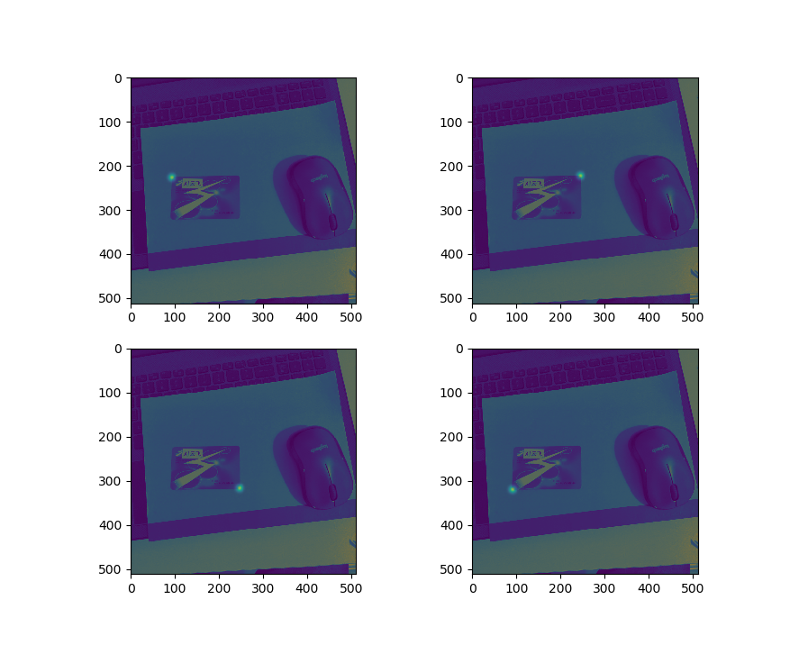
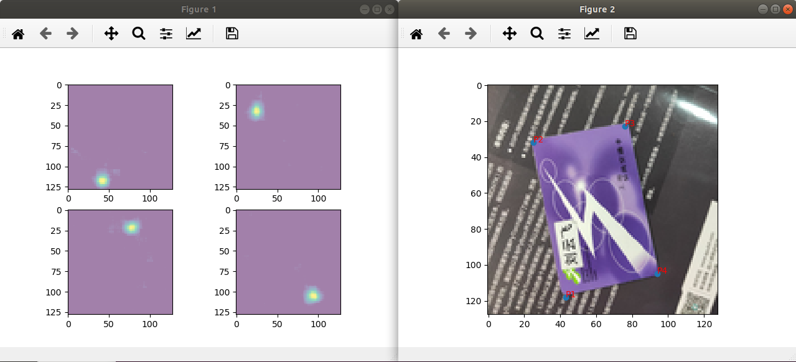
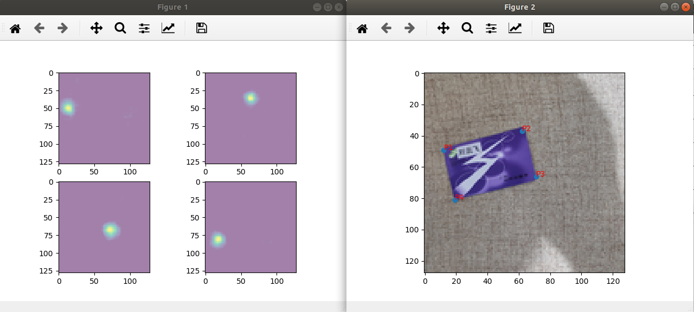

# KeyPointsDetection 关键点识别网络
程序编写与测试：刘云飞

建议与合作联系邮箱：[liuyunfei.1314@163.com](mailto:liuyunfei.1314@163.com)

#### 0x00 语言和工具

框架：PyTorch 1.2.0

语言：Python 3.7

在ubuntu 18.03测试通过

#### 0x01 数据准备

标注数据类似下面，512x512 pixel

图片2

增加上2D高斯  点云 的Heatmap图如下

#### 0x02 训练

训练使用Houeglass模型，128*128进行训练

基本结构如下，漏斗式结构

#### 0x03 结果

下图左侧为检测到的四个点的heatmap，右侧为加上原图的效果，可以看到效果还不错～

结果图例1

结果图例2

#### 0x04 后续

人体关键点检测

人脸关键点检测

